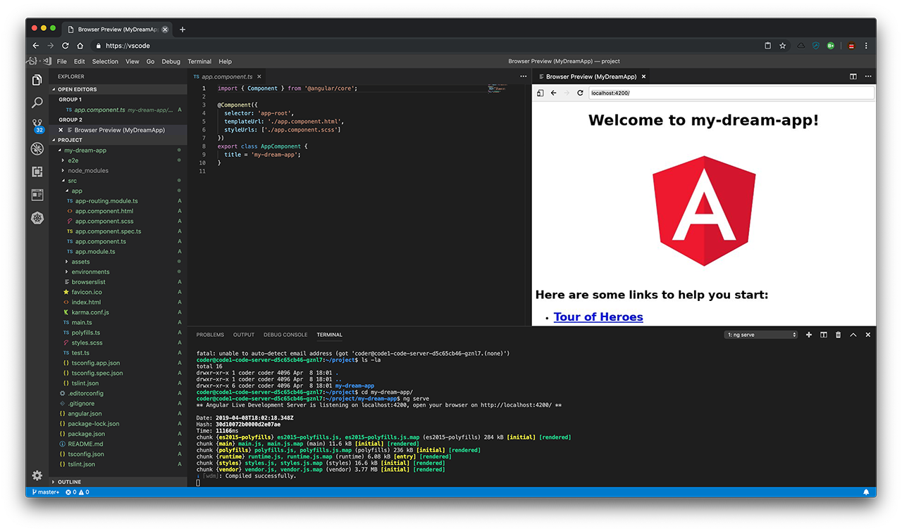

# Visual Studio Code Server

The aim of this repository is to package [Visual Studio Code](https://code.visualstudio.com/) using [code-server](https://github.com/codercom/code-server) in a full-fledged [Ubuntu](https://www.ubuntu.com/desktop/developers) Developer environment.

This repository hosts a Dockerfile and Helm Chart to run VSCode on Kubernetes. We use [Helmi](https://github.com/monostream/helmi) to provide VSCode-as-a-SErvice in the Service Catalog of [Monostream DevCloud](https://www.monostream.com/cloud) - a managed Kubernetes and [Eirini](https://www.cloudfoundry.org/project-eirini/) based CaaS & PaaS.



## Run in Docker

```bash
docker run -it --rm --name code-server --security-opt=seccomp:unconfined -p 127.0.0.1:8443:8443 -v $(pwd)/project:/home/coder/project monostream/code-server:latest --allow-http --no-auth
```

## Install using Helm

```bash
cat <<EOF | helm install ./chart/ --name vscode --tiller-namespace=tiller -f -
image:
  tag: latest
  pullPolicy: Always
ingress:
  enabled: true
  annotations:
    kubernetes.io/tls-acme: "true"  
  hosts:
  - host: my-vscode.local
    paths:
    - /
  tls:
  - hosts:
    - my-vscode.local
    secretName: my-vscode-tls
password: changemenow
EOF
```